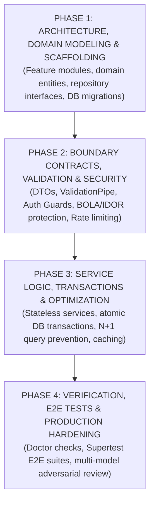

# NestJS Backend Engineering & Architecture Playbook

Enterprise best practices, architectural patterns, and quality standards for designing, refactoring, and auditing NestJS backend applications.

---

## 4-Phase Backend Engineering Workflow



1. **Phase 1 — Architecture, Domain Modeling & Scaffolding:**
   - Organize by feature modules (`OrdersModule`, `UsersModule`) rather than technical layers.
   - Define domain entities, branded types, and database migrations before writing controller endpoints.
   - Scaffold repository interfaces and test fixtures first.

2. **Phase 2 — Boundary Contracts, Validation & Security:**
   - Define strict DTOs with `class-validator` and `class-transformer` or Zod schemas.
   - Configure global `ValidationPipe({ whitelist: true, forbidNonWhitelisted: true, transform: true })`.
   - Bind authentication (`JwtAuthGuard`) and authorization (`RolesGuard`) to endpoints; enforce object-level ownership checks (BOLA/IDOR).
   - Configure output sanitization (`ClassSerializerInterceptor`) and rate limiting (`@nestjs/throttler`).

3. **Phase 3 — Service Logic, Transactions & Optimization:**
   - Keep services stateless singletons; never store per-request state in instance fields.
   - Wrap multi-step mutations in atomic database transactions (`prisma.$transaction()` or TypeORM `QueryRunner`).
   - Eliminate N+1 query waterfalls using eager joins, batch queries, or DataLoaders.
   - Implement caching (Redis / in-memory cache) with explicit TTLs for frequently read data.

4. **Phase 4 — Verification, E2E Tests & Production Hardening:**
   - Run pre-flight doctor checks (database liveness, Redis ping, migration status).
   - Author behavioral Supertest E2E suites exercising real HTTP request paths and database mutations.
   - Execute static code audit via `scripts/audit-nestjs.sh`.
   - Run adversarial interrogation across security and transaction boundaries.

---

## 7 Core Doctrines for Backend Engineers & AI Agents

### Doctrine 1: Domain-Driven Modular Architecture (Thin Controllers & Separation of Concerns)

- **Feature Modules:** Organize code into self-contained feature modules (`modules/orders/`) containing controllers, services, repositories, and DTOs.
- **Thin Controllers (< 150 lines):** Controllers only extract HTTP parameters (`@Body()`, `@Param()`, `@Query()`), invoke services, and return status codes. Strictly ban inline SQL, Prisma queries, or business math in controllers.
- **Stateless Singletons:** Services must be stateless; favor pure domain functions with returned values over mutating object properties.
- **Repository Pattern:** Abstract database access behind repository interfaces to maintain testability and decouple business logic from ORM implementation.
- Refer to [references/architecture-and-code-walkthrough.md](./references/architecture-and-code-walkthrough.md) for request lifecycle tracing.

### Doctrine 2: Dependency Injection & Provider Discipline

- **Constructor Injection:** Always inject dependencies via class constructors using `private readonly`; avoid property injection (`@Inject()` on properties).
- **Type-Safe Tokens:** Use `Symbol()` or custom injection tokens (`InjectionToken<T>`) for interface injection instead of raw strings.
- **Avoid Service Locator Anti-Pattern:** Never inject the NestJS `ModuleRef` to dynamically resolve providers inside business logic; declare dependencies explicitly in constructor signatures.
- **Scope Awareness:** Understand singleton vs. request vs. transient scopes; request-scoped providers cascade performance penalties across the entire dependency graph.

### Doctrine 3: Strict Boundary Validation & API Security

- **Global Validation Pipe:** Ensure `ValidationPipe` is registered globally with `whitelist: true` (strips unmapped fields) and `forbidNonWhitelisted: true` (rejects unmapped properties).
- **Object-Level Authorization (BOLA/IDOR):** Every endpoint accessing or mutating user/tenant data must verify ownership against `req.user.id` or `tenantId`.
- **Sanitize Output:** Prevent sensitive data exposure (password hashes, secret keys) via `ClassSerializerInterceptor` (`@Exclude()`) or explicit response DTO mapping.
- **Rate Limiting:** Protect public authentication and webhook endpoints with `@nestjs/throttler`.

### Doctrine 4: Database Optimization & Transactional Integrity

- **Atomic Multi-Step Mutations:** Any operation mutating multiple tables or rows must execute inside an atomic transaction.
- **N+1 Query Prevention:** Always load relations with eager joins, batch queries, or DataLoaders rather than mapping queries inside loops.
- **Indexing:** Ensure all foreign keys, lookup columns, and filter fields have explicit database indexes.
- **Connection Pool Sizing:** Configure database pools with explicit max connections and idle timeouts to prevent pool exhaustion.

### Doctrine 5: TypeScript Discipline & Compile-Time Proofs

- **Treat Compiler as Proof Assistant:** Make illegal domain states unrepresentable using discriminated unions (`type Order = { status: 'draft' } | { status: 'placed'; invoiceId: string }`).
- **Brand Entity IDs:** Brand primary keys (`UserId`, `OrderId`, `TenantId`) to eliminate cross-assignment bugs.
- **Zero `as any`:** Treat external data as `unknown` and validate via schemas before narrowing.
- **Exhaustiveness:** Use `const _exhaustive: never = state;` in switch statement `default` arms.
- Refer to [references/typescript-best-practices.md](./references/typescript-best-practices.md).

### Doctrine 6: Code Documentation Integrity & Unslop Writing

- **Zero Meaningless Comments:** Strictly ban comments that merely narrate trivial code (`// inject user service`, `// find user by id`, `// return response`).
- **Zero Dead Commented-Out Code:** Never commit commented-out code blocks; rely on Git history.
- **High-Signal "WHY" Explanations:** Comments solely document non-obvious business rules, database lock strategies, or concurrency decisions.
- **Cut AI Jargon:** Ban decorative AI vocabulary ("crucial", "pivotal", "delve", "foster", "testament", "tapestry", "landscape", "enhance"). Use plain numbers and active voice.
- Refer to [references/unslop.md](./references/unslop.md).

### Doctrine 7: Foundational Engineering & AI Pairing Principles

Refer to [references/foundational-engineering-principles.md](./references/foundational-engineering-principles.md) for full execution guides:

- **Fix Root Causes:** Trace exceptions to their origin; reject nil-check patches (`?.`) that mask broken upstream contracts.
- **Foundational Thinking:** Model domain data structures and entities before writing controller endpoints.
- **Guard Context Window:** Summarize heavy migration or test outputs; read files with targeted line ranges.
- **Prove It Works:** Verify endpoints with live HTTP requests and deterministic Supertest suites; never rely on "it compiles".
- **Test Behavior, Not Implementation:** Assert observable response status codes and body payloads rather than mock call counts; eliminate tests that pass when functions return `undefined`.
- **Laziness Protocol:** Bias toward deletion; keep call depth under 3 layers (`Controller -> Service -> Repository`); minimize diffs.
- **Attack the Premise:** When repeated concurrency or deadlock fixes fail, challenge the shared assumption and remove structural asymmetry.
- **Minimize Reader Load:** Collapse pass-through wrappers; keep services stateless; ensure any engineer can trace an endpoint in under 30 seconds.
- **Model the Domain:** Replace scattered booleans with state machines and discriminated unions; eliminate synchronized database boolean columns.
- **Never Block on the Human:** Proceed autonomously on reversible backend engineering tasks and present verified results; reserve prompts for irreversible actions (e.g. dropping production tables).
- **Outcome-Oriented Execution:** Converge directly on target backend architecture during refactors without authoring disposable compatibility shims.
- **Redesign from First Principles:** When integrating new business requirements, design the schema and entities as if present from day one rather than bolting on ad hoc patches.
- **Sequence Verifiable Units:** Decompose work into atomic before/after brackets (red-to-green per unit); stack commits to prove correctness.
- **Subtract Before You Add:** Delete dead endpoints, unused service methods, and legacy DTOs before building new capabilities.
- **Type-System Discipline:** Build types as constructions; brand entity IDs; parse external boundaries; enforce compile-time exhaustiveness.
- **Migrate Callers Then Delete Legacy APIs:** When replacing internal service methods or endpoints, migrate all callers and delete the old API in the same wave.
- **Adversarial Interrogation:** Multi-model review challenging security, concurrency, and architecture before merging.
- **Maintain Verification Upkeep:** Continuously verify feature maps and test harnesses against live backend behavior to eliminate documentation drift.

---

## Detailed Rules Directory (Progressive Disclosure)

When implementing or reviewing specific areas, inspect only the matching rule files on-demand:

- **Architecture (`arch-`):** [Avoid Circular Deps](./rules/arch-avoid-circular-deps.md) | [Feature Modules](./rules/arch-feature-modules.md) | [Module Sharing](./rules/arch-module-sharing.md) | [Single Responsibility](./rules/arch-single-responsibility.md)
- **Dependency Injection (`di-`):** [Avoid Service Locator](./rules/di-avoid-service-locator.md) | [Constructor Injection](./rules/di-prefer-constructor-injection.md) | [Provider Scopes](./rules/di-scope-awareness.md) | [Interface Tokens](./rules/di-use-interfaces-tokens.md) | [ISP](./rules/di-interface-segregation.md) | [LSP](./rules/di-liskov-substitution.md)
- **Error Handling (`error-`):** [Exception Filters](./rules/error-use-exception-filters.md) | [HTTP Exceptions](./rules/error-throw-http-exceptions.md) | [Async Errors](./rules/error-handle-async-errors.md)
- **Security (`security-`):** [Validate All Input](./rules/security-validate-all-input.md) | [Use Guards](./rules/security-use-guards.md) | [JWT Auth](./rules/security-auth-jwt.md) | [Rate Limiting](./rules/security-rate-limiting.md) | [Sanitize Output](./rules/security-sanitize-output.md)
- **Performance (`perf-`):** [Use Caching](./rules/perf-use-caching.md) | [Optimize Database](./rules/perf-optimize-database.md) | [Lazy Loading](./rules/perf-lazy-loading.md) | [Async Hooks](./rules/perf-async-hooks.md)
- **Database & ORM (`db-`):** [Use Transactions](./rules/db-use-transactions.md) | [Avoid N+1 Queries](./rules/db-avoid-n-plus-one.md) | [Use Migrations](./rules/db-use-migrations.md)
- **API Design (`api-`):** [DTO Serialization](./rules/api-use-dto-serialization.md) | [Use Pipes](./rules/api-use-pipes.md) | [Use Interceptors](./rules/api-use-interceptors.md) | [API Versioning](./rules/api-versioning.md)
- **Testing (`test-`):** [Supertest E2E](./rules/test-e2e-supertest.md) | [Use TestingModule](./rules/test-use-testing-module.md) | [Mock External Services](./rules/test-mock-external-services.md)
- **Microservices (`micro-`):** [Message Patterns](./rules/micro-use-patterns.md) | [Health Checks](./rules/micro-use-health-checks.md) | [Queues](./rules/micro-use-queues.md)
- **DevOps (`devops-`):** [ConfigModule](./rules/devops-use-config-module.md) | [Structured Logging](./rules/devops-use-logging.md) | [Graceful Shutdown](./rules/devops-graceful-shutdown.md)

---

## Verification Checklist

Always run the full quality audit before completing tasks or merging code:

- Refer to [references/verification-checklist.md](./references/verification-checklist.md) for the 9-tier audit checklist.
- Run the automated static audit (supports `--strict` to return non-zero exit code on critical findings):
  ```bash
  ./scripts/audit-nestjs.sh src/ --strict
  ```
