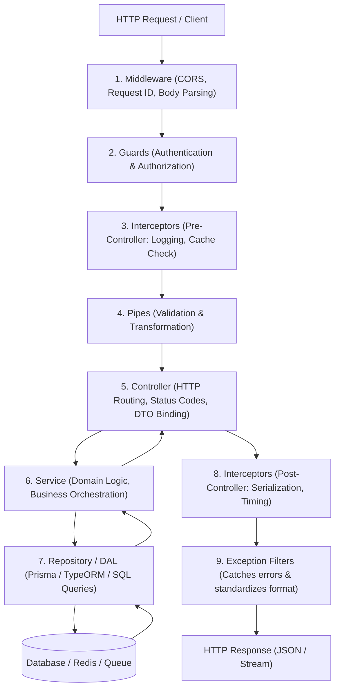

# NestJS Architecture, Lifecycle & Code Walkthrough

Architectural tracing, request lifecycle navigation, and component placement guidelines for NestJS backend systems.

---

## 1. The NestJS Request Lifecycle

Understanding the exact sequence of execution is critical for proper architectural separation of concerns.



---

## 2. Layer Placement Decision Tree

When implementing a new requirement, use this decision tree to place code in the correct architectural layer:

```text
Where does my code belong?
│
├── Is it validating client credentials, API keys, or roles?
│   └── ➡️ GUARD (@UseGuards(JwtAuthGuard, RolesGuard))
│
├── Is it validating format, types, or sanitizing request input?
│   └── ➡️ PIPE & DTO (@UsePipes(ValidationPipe), class-validator DTOs)
│
├── Is it binding HTTP parameters (@Param, @Query, @Body) and returning status codes?
│   └── ➡️ CONTROLLER (Keep thin: < 100-150 lines. No database queries!)
│
├── Is it coordinating domain business rules, external services, or transactions?
│   └── ➡️ SERVICE (Stateless singleton @Injectable(). No direct HTTP objects!)
│
├── Is it executing SQL, Prisma queries, or TypeORM entity operations?
│   └── ➡️ REPOSITORY / DAL (Isolate database specifics from domain services)
│
├── Is it measuring request duration, logging telemetry, or caching response payloads?
│   └── ➡️ INTERCEPTOR (Implements NestInterceptor, wraps handle() RxJS Observable)
│
├── Is it transforming unhandled errors into standardized HTTP JSON responses?
│   └── ➡️ EXCEPTION FILTER (Implements ExceptionFilter, @Catch(HttpException))
│
└── Is it executing background tasks, sending emails, or processing asynchronously?
    └── ➡️ QUEUE PROCESSOR / EVENT HANDLER (@Processor('queue-name'), @OnEvent('event.name'))
```

---

## 3. The 5-Step Execution Flow Tracing

When exploring an existing NestJS feature or explaining "how does X work?":

1. **Locate the Entry Point:**
   - Identify the `@Controller()` decorator, route prefix, and HTTP verb method (`@Get()`, `@Post()`).
   - Check which `@UseGuards()`, `@UseInterceptors()`, and `@UsePipes()` are bound at class or method level.

2. **Inspect the Boundary Contract:**
   - Examine the parameter decorators (`@Body() dto: CreateOrderDto`).
   - Verify validation decorators and transformation rules in the DTO class.

3. **Trace the Service Orchestration:**
   - Step into the injected `@Injectable()` service method.
   - Trace external API calls, transaction boundaries, and event emissions (`EventEmitter2`).

4. **Examine Data Persistence:**
   - Step into the Repository or Prisma/TypeORM queries.
   - Inspect database indexes, query joins, and potential N+1 query patterns.

5. **Trace the Response Pipeline:**
   - Check post-controller Interceptors (e.g. `ClassSerializerInterceptor`).
   - Identify which Exception Filters handle potential errors thrown during execution.

---

## 4. Senior Engineer Mental Models: Structuring Walkthroughs

When presenting code walkthroughs to engineers or onboarding new teammates:
- **State the Business Intent:** One clear paragraph explaining the user goal before detailing implementation.
- **Provide a High-Level Diagram:** Visual flow connecting the Controller, Service, and Storage layer.
- **File Map with Responsibilities:** List participating files with single-line descriptions of their role.
- **Gotchas and Edge Cases:** Call out non-obvious failure modes (e.g., race conditions, token expiration, database connection limits).
