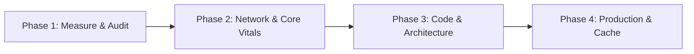

# Next.js, React & Web Performance Optimization Playbook

A unified, production-grade playbook for engineering high-performance, cost-efficient, and responsive Next.js and React web applications. Integrates Vercel Engineering best practices, Google Core Web Vitals standards, and Lighthouse performance auditing.

## When to Apply This Skill

Activate this skill whenever:

- Writing, reviewing, or refactoring **React components** or **Next.js App/Pages Router** code.
- Answering "how does X work" questions, conducting code walkthroughs, or resolving placement and layering questions ("where should this live", "is this the right layer").
- Debugging or improving **Core Web Vitals**: **LCP** (> 2.5s), **INP** (> 200ms), or **CLS** (> 0.1).
- Diagnosing slow page loads, blocking data fetching waterfalls, or excessive re-renders.
- Reducing **JavaScript bundle size**, eliminating barrel files, or setting up dynamic imports.
- Optimizing **Vercel deployment costs**, function invocations, compute duration, and caching.
- Auditing site performance against a **Performance Budget** (TTFB, Critical Rendering Path).
- Reviewing UI components for **Web Interface Guidelines** compliance.

---

## 4-Phase Optimization Workflow

Follow this sequential workflow to achieve maximum performance impact:

### Phase 1: Audit & Bottleneck Identification

1. **Detect framework & setup:** Inspect `package.json`, `next.config.js|ts`, and rendering model (RSC vs Client Components).
2. **Trace architecture & placement:** Refer to [references/architecture-and-code-walkthrough.md](./references/architecture-and-code-walkthrough.md) to trace the entry point, data flow across RSC boundaries, and layer ownership.
3. **Run performance scan:** Execute [scripts/audit-performance.sh](./scripts/audit-performance.sh) on the codebase.
4. **Categorize issues by severity:**
   - **Critical:** Network waterfalls, uncompressed LCP assets, massive client bundle (> 300KB JS).
   - **High:** Inefficient server data fetching, un-cached database queries, high CLS (> 0.1).
   - **Medium:** Unnecessary component re-renders, missing responsive image sizes, font shifts.
   - **Low:** Micro JavaScript optimizations, SVG precision.

### Phase 2: Core Web Vitals & Critical Rendering Path

Refer to [references/core-web-vitals.md](./references/core-web-vitals.md) and [references/website-performance-budget.md](./references/website-performance-budget.md):

- **Target LCP (≤ 2.5s):**
  - Preload LCP hero image: `<link rel="preload" href="/hero.webp" as="image" fetchpriority="high" />`.
  - Inline critical above-the-fold CSS (< 14KB).
  - Prerender likely-next navigations with the **Speculation Rules API**.
  - Keep TTFB < 800ms via CDN caching and Edge rendering.
- **Target INP (≤ 200ms):**
  - Break long JavaScript tasks (> 50ms) using `scheduler.yield()` or `setTimeout(..., 0)`.
  - Move heavy data filtering/sorting to web workers or defer with `useTransition` / `useDeferredValue`.
  - Use passive listeners `{ passive: true }` for touch/scroll events.
- **Target CLS (≤ 0.1):**
  - Always set explicit `width` and `height` or `aspect-ratio` on all ``, `<video>`, and `<iframe>`.
  - Reserve space for dynamic banners and ads with CSS `min-height`.
  - Match fallback fonts with custom fonts using `font-display: swap` and `size-adjust`.

### Phase 3: React & Next.js Code Optimization (Server-First & No-useEffect Doctrine)

Refer to [references/react-best-practices.md](./references/react-best-practices.md):

- **Golden Rule 1: Strictly Restrict Client-Side Rendering (CSR):**
  - **Server Components (RSC) by Default:** Never add `'use client'` to layouts, page routes, or data-fetching components.
  - **Push `'use client'` to Leaf Nodes:** Only mark leaf components that require user event listeners (`onClick`), React client state (`useState`), or browser APIs. Pass RSC as `children` into Client Components.
  - **Server Data Fetching:** All data fetching, DB queries, and ORM calls must stay in Server Components or Server Actions (`'use server'`). Eliminate client-side initial fetch waterfalls.

- **Golden Rule 2: Strictly Eliminate Unnecessary `useEffect`:**
  - **No `useEffect` for data fetching:** Fetch directly in async Server Components or use TanStack Query / SWR if strictly in client leaves.
  - **No `useEffect` for derived state:** Calculate derived values synchronously during render (`const fullName = first + ' ' + last`) or wrap in `useMemo()` if expensive.
  - **No `useEffect` for user events:** Put side-effects directly inside event handlers (`onClick`, `onSubmit`), not in reactive effects.
  - **No `useEffect` for resetting state:** Use component `key` props (`<Profile key={userId} />`) to reset state when props change.
  - **Only valid use of `useEffect`:** Subscribing to non-React browser APIs (canvas, web audio, window resize listeners) with explicit cleanup functions.

- **Golden Rule 3: TypeScript Discipline & Boundary Integrity:**
  - **Discriminated Unions:** Model component variants and async states with a literal discriminant (`status: 'loading' | 'success' | 'error'`). Ban loose optional-field bags (`{ loading?: boolean; data?: T; error?: string }`).
  - **Branded Types:** Brand primitives for entity IDs (`type UserId = string & { readonly __brand: 'UserId' }`) to eliminate ID misplacement at compile-time.
  - **Runtime Schemas Before Guards:** Validate all external boundaries (Server Actions, Route Handlers, `searchParams`) using runtime schemas (Zod). Infer TypeScript types with `z.infer`.
  - **`unknown` Over `any` & No Unearned `as`:** Treat all external data as `unknown`. Never cast with `as Type` without first validating the structure. Use `satisfies` to validate shapes without widening literals.
  - **Exhaustiveness Checking:** Inline `const _exhaustive: never = state;` in switch `default` arms so adding variants triggers compile errors.

- **Golden Rule 4: Separation of Concerns (Thin Components and Data Layer Abstraction):**
  - **Thin Components and Pages:** Components and pages must be pure view layers (UI orchestrators). A component's sole responsibility is receiving or fetching data, binding it to JSX, and handling loading and error states.
  - **Extract Server Data Operations to `lib/` or `services/` (DAL):** Never write inline SQL, raw ORM joins, schema parsers, or complex data transformations directly inside component or page files. Abstract all database and API access into dedicated Data Access Layer modules (such as `lib/services/orders.ts` or `lib/dal/users.ts`).
  - **Extract Client State and Logic to Custom Hooks (`hooks/`):** Complex client-side state transitions, filtering algorithms, form handlers, and browser subscriptions must live in custom hooks (such as `useProductFilters.ts`) or pure utility functions (`lib/utils/formatters.ts`). Component files should remain concise (< 150-200 lines).

- **Golden Rule 5: Code Documentation Hygiene (Zero Meaningless Comments, High-Signal and Fresh Only):**
  - **Zero Meaningless or Obvious Comments:** Strictly ban comments that merely narrate what the code already expresses (`// handle click`, `// fetch user`, `// render button`, `// return result`, `// state for open modal`).
  - **Zero Commented-Out Dead Code:** Never leave commented-out legacy code blocks (`// const oldWay = ...`). Rely on Git history instead.
  - **Document the "WHY", Not the "WHAT":** Comments must only be used to explain non-obvious business logic, browser workarounds, performance optimization trade-offs, or complex mathematical formulas.
  - **Must Be Up-to-Date (Fresh):** Any comment that does not accurately match the latest refactored code must be updated immediately or purged. A stale comment is treated as a critical bug.

- **Golden Rule 6: Unslop Writing and Technical Communication Discipline:**
  - **Cut AI Tells and Jargon:** Ban AI vocabulary ("crucial", "pivotal", "delve", "foster", "testament", "tapestry", "landscape", "enhance"). Use plain words ("important", "examine", "help", "improve").
  - **Say What It Does, Not How It Feels:** Write concrete mechanisms and numbers instead of feelings. State facts directly.
  - **No Decorative Emojis or Em Dashes:** Keep technical documentation, comments, and PR descriptions clean. Use periods or commas instead of em dashes.
  - **Active Voice:** Write "the compiler checks types" instead of "types are checked by the compiler".

- **Golden Rule 7: Foundational Engineering & AI Pairing Principles for Frontend Developers:**
  - Refer to [references/foundational-engineering-principles.md](./references/foundational-engineering-principles.md) for full execution guides.
  - **Fix Root Causes:** Trace hydration errors and UI regressions to origin; reject nil-check patches (`?.`) that mask broken data contracts.
  - **Foundational Thinking:** Model core types, domain models, and state shapes before writing JSX layouts or animations.
  - **Guard the Context Window:** Prevent context bloat by passing high-level summaries of Lighthouse audits and bundle stats instead of dumping raw JSON.
  - **Prove It Works:** Verify tasks against actual running feature paths and deterministic check scripts (`audit-performance.sh`); never rely on "it compiles".
  - **Test Behavior, Not Implementation:** Assert literal user-observable outputs against concrete inputs; delete tests that pass if imports return `undefined`.
  - **Laziness Protocol:** Bias toward deletion; keep component/call hierarchies shallow (< 3 layers); reject signal threading across unrelated components.
  - **Attack the Premise:** When multiple fixes fail the same gate, formulate the shared assumption, measure actor skew, and remove structural asymmetry.
  - **Minimize Reader Load:** Collapse single-caller wrappers; shrink mutable state scope; ensure any engineer can trace values in under 30 seconds.
  - **Model the Domain:** Replace scattered booleans with state machines, lookup tables, and discriminated unions; eliminate synchronized boolean pairs.
  - **Never Block on the Human:** Proceed autonomously on reversible code changes and present verified results; reserve blocks for irreversible actions.
  - **Outcome-Oriented Execution:** Converge directly on target component architectures during refactors without authoring disposable compatibility layers.
  - **Redesign from First Principles:** When integrating new UI features, design as if present from day one rather than bolting on ad hoc prop patches.
  - **Sequence Verifiable Units:** Decompose multi-step work into atomic before/after brackets (red-to-green per unit); stack commits to prove correctness.
  - **Subtract Before You Add:** Remove dead code, obsolete component variants, and redundant validators before constructing new features.
  - **Type-System Discipline:** Treat TypeScript as a proof assistant; construct illegal states away; brand entity IDs; parse boundaries with Zod; enforce `never` exhaustiveness.
  - **Migrate Callers Then Delete Legacy APIs:** When replacing internal hooks, components, or utilities, migrate all callers and delete the old API in the same wave.

- **Eliminate Waterfalls (Critical):**
  - Replace sequential `await` with `Promise.all()` for independent calls.
  - Defer `await` into branch conditions where actually used.
  - Stream slow components using `<Suspense>` boundaries.

- **Bundle Size Optimization (Critical):**
  - Eliminate barrel file imports (`import { Button } from '@/components'` to `import { Button } from '@/components/Button'`).
  - Code-split heavy components with `next/dynamic({ ssr: false })`.
  - Defer 3rd-party analytics and scripts until after hydration (`next/script` with `strategy="lazyOnload"`).

- **Re-render Optimization (Medium):**
  - Use functional state updates `setCount(c => c + 1)` to keep callbacks stable.
  - Apply `content-visibility: auto` to long lists to bypass off-screen rendering.

### Phase 4: Production, Vercel and Caching Optimization

Refer to [references/vercel-optimization.md](./references/vercel-optimization.md):

- **Cache-Control and ISR:** Use Incremental Static Regeneration (`revalidate`) and Stale-While-Revalidate headers to serve cached HTML from the Edge.
- **Function Invocations and Compute:** Shift static pages from SSR to SSG/ISR to reduce cold starts and Vercel compute costs.
- **Verify with Scorecard:** Run verification checklist in [references/verification-checklist.md](./references/verification-checklist.md).

---

## Performance Budget Reference

| Resource              |    Target Budget    | Optimization Method                                            |
| :-------------------- | :-----------------: | :------------------------------------------------------------- |
| **Total Page Weight** |    **< 1.5 MB**     | Brotli compression, code-splitting, asset cleanup              |
| **Client JavaScript** | **< 300 KB** (gzip) | Dynamic imports, barrel file removal, tree-shaking             |
| **CSS (Above-fold)**  |    **< 100 KB**     | Critical CSS extraction, purge unused utility classes          |
| **LCP Hero Image**    |    **< 500 KB**     | AVIF/WebP formats, responsive `srcset`, `fetchpriority="high"` |
| **Web Fonts**         |    **< 100 KB**     | WOFF2 format, font subsetting, `font-display: swap`            |
| **Server TTFB**       |    **< 800 ms**     | Edge caching, Database indexing, regional compute placement    |

---

## Detailed Reference Documents

Read these reference files progressively when executing targeted phases:

- [`references/react-best-practices.md`](./references/react-best-practices.md): The 70 prioritized Vercel rules (waterfalls, bundle, server vs client, rerenders).
- [`references/typescript-best-practices.md`](./references/typescript-best-practices.md): TypeScript discipline, discriminated unions, branded types, and schema validation.
- [`references/architecture-and-code-walkthrough.md`](./references/architecture-and-code-walkthrough.md): Architectural exploration, execution flow tracing, and component/layer placement decisions.
- [`references/foundational-engineering-principles.md`](./references/foundational-engineering-principles.md): Root-cause problem solving, data structures first, and context window efficiency.
- [`references/unslop.md`](./references/unslop.md): Writing discipline, removing AI tells, jargon removal, and plain speech.
- [`references/core-web-vitals.md`](./references/core-web-vitals.md): LCP, INP, CLS diagnostics, scripts, and Speculation Rules API.
- [`references/website-performance-budget.md`](./references/website-performance-budget.md): TTFB, Critical Rendering Path, HTTP/3, Early Hints, asset compression.
- [`references/vercel-optimization.md`](./references/vercel-optimization.md): Observability-first cost reduction, fluid compute, and caching architecture.
- [`references/web-interface-guidelines.md`](./references/web-interface-guidelines.md): UI/UX consistency, interaction feedback, and design quality standards.
- [`references/verification-checklist.md`](./references/verification-checklist.md): Pre-release audit checklist and verification test suite.
